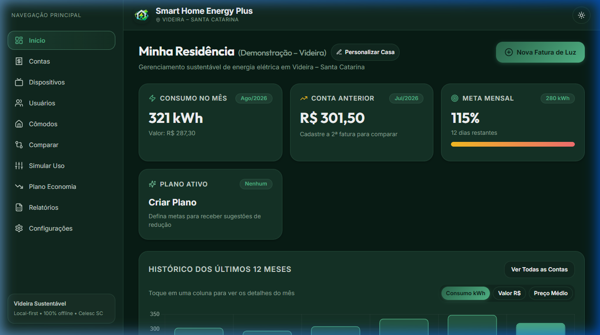

# Smart Home Energy Manager Plus

<p align="center">
  
</p>

<p align="center">
  <strong>Aplicativo inteligente para gerenciamento residencial de consumo e economia de energia elétrica.</strong><br>
  100% Offline (Local-First com SQLite) • Multiplataforma (Android, Windows e Web) • Motor Matemático em Rust
</p>

<p align="center">
  <a href="https://github.com/CarlosMiguens/smart-home-energy-manager-plus/releases/latest/download/smart-home-energy-manager-plus-compacto.apk">
    
  </a>
  
  
</p>

---

## 📱 Download do Aplicativo (APK Android)

Você pode baixar e instalar o aplicativo no seu celular Android diretamente:

* 📦 **Download Direto da Release:** [smart-home-energy-manager-plus-compacto.apk](https://github.com/CarlosMiguens/smart-home-energy-manager-plus/releases/latest/download/smart-home-energy-manager-plus-compacto.apk)
* 📂 **Download pelo Repositório:** [Clique aqui para acessar a pasta dist-apk](dist-apk/smart-home-energy-manager-plus-compacto.apk)

### Como instalar no Android:
1. Baixe o arquivo `.apk` no seu celular ou transfira-o do computador.
2. Ao tocar no arquivo, autorize a instalação de fontes desconhecidas caso o Android solicite.
3. Conclua a instalação e abra o aplicativo normalmente. Não requer login nem conexão com a internet!

---

## 📸 Interface do Aplicativo

<p align="center">
  
</p>

---

## 💡 O Que é o Aplicativo?

O **Smart Home Energy Manager Plus** é uma aplicação projetada para ajudar famílias e residências a entenderem exatamente para onde vai cada centavo gasto na conta de luz e como reduzir despesas sem perder o conforto.

Diferente de planilhas complexas ou soluções que exigem sensores caros na tomada, o aplicativo utiliza os dados da sua fatura e o catálogo de aparelhos da sua casa para calcular com precisão matemática o impacto financeiro de cada equipamento.

### Principais Diferenciais:
* **Privacidade Total (Local-First):** Seus dados são salvos em um banco de dados SQLite local no próprio dispositivo. Nenhuma informação pessoal ou de fatura é enviada para servidores externos.
* **Cálculos Determinísticos em Rust:** Toda a matemática de conversão (Watts para kWh, custo por minuto/hora, tarifas e projeções) é calculada por um motor nativo em Rust de alta performance.
* **Precisão Financeira:** Os cálculos monetários utilizam representação em centavos inteiros, evitando erros de arredondamento.

---

## 🚀 O Que Você Pode Fazer com o App?

* 📊 **Gerenciamento de Faturas:** Cadastre suas contas de luz, acompanhe o histórico dos últimos 12 meses e veja a variação de consumo (kWh) e preço médio pago por kWh.
* 🔌 **Catálogo de Dispositivos:** Cadastre eletrodomésticos com potência em Watts, quantidade e tempo médio de uso diário.
* ⏱️ **"Quanto Custa Usar Este Aparelho?":** Descubra instantaneamente em reais (R$) quanto custa ligar um ar-condicionado, chuveiro, videogame ou ferro de passar por 15 minutos, 30 minutos, 1 hora ou 2 horas.
* 📉 **Simulador de Hábitos:** Teste cenários como *"e se eu reduzir 10 minutos do chuveiro por dia?"* ou *"e se desligar o ar-condicionado 1 hora mais cedo?"* e veja a economia estimada no mês e no ano antes de tomar a decisão.
* 🎯 **Planos de Economia Inteligentes:** Defina metas percentuais (ex: economizar 10% ou 15%) e receba sugestões automáticas baseadas nos aparelhos que mais consomem na casa.
* 🏠 **Divisão por Cômodos e Moradores:** Veja quanto cada cômodo (Cozinha, Quartos, Sala) e cada morador consome da fatura mensal.
* 📄 **Relatórios e Exportação:** Gere relatórios consolidados com visualização para impressão e exportação em formato CSV.

---

## 📖 Guia de Uso Passo a Passo

### Passo 1: Primeiro Acesso ou Dados de Demonstração
Ao abrir o app pela primeira vez, você pode seguir o assistente rápido para preencher o nome da residência e sua primeira conta de luz.  
> **Dica Rápida:** Você também pode ir na aba **Configurações** e clicar em **"Carregar Casa de Demonstração"** para testar imediatamente todas as telas com dados reais pré-carregados!

### Passo 2: Cadastrar uma Fatura de Luz
1. No menu lateral ou rodapé, clique em **Contas**.
2. Clique no botão **"+ Nova Fatura"**.
3. Informe o mês/ano de referência, o valor total pago em R$ e o consumo total em kWh indicado na sua conta de energia.
4. O app calcula automaticamente o preço médio efetivo pago por kWh.

### Passo 3: Cadastrar os Aparelhos da Residência
1. Acesse a aba **Dispositivos**.
2. Clique em **"+ Novo Dispositivo"**.
3. Preencha o nome do aparelho, selecione a categoria, informe a potência em Watts (informação que fica na etiqueta do aparelho), as horas de uso por dia e os dias de uso no mês.
4. O aplicativo já exibe na hora o consumo em kWh e o custo mensal previsto.

### Passo 4: Simular Economia
1. Acesse a aba **Simular Uso**.
2. Escolha qualquer eletrodoméstico da lista.
3. Ajuste a barra deslizante para diminuir o tempo de uso diário.
4. Veja na hora o valor em dinheiro poupado a cada mês e o acumulado anual!

---

## 🛠️ Tecnologias Utilizadas

* **Plataforma:** [Tauri v2](https://v2.tauri.app/) (Desktop Windows & Android)
* **Backend:** Rust (Motor matemático `energy_engine`, SQLite via `rusqlite bundled`)
* **Frontend:** React 18, TypeScript, Vite 6
* **Visualização de Dados:** Chart.js e React-Chartjs-2
* **Ícones:** Lucide React
* **Estilização:** CSS Vanilla Modular e Responsivo

---

## 💻 Como Executar o Código Fonte

### Pré-requisitos
* [Node.js](https://nodejs.org/) (v18 ou superior)
* [Rust & Cargo](https://rustup.rs/) (para compilar Tauri / Android / Windows)

### 1. Clonar o Repositório
```bash
git clone https://github.com/CarlosMiguens/smart-home-energy-manager-plus.git
cd smart-home-energy-manager-plus
```

### 2. Instalar as Dependências
```bash
npm install
```

### 3. Executar em Modo Web (Navegador)
```bash
npm run dev
```
O app estará acessível em `http://localhost:1420`.

### 4. Executar em Modo Desktop com Tauri (Windows)
```bash
npm run tauri:dev
```

### 5. Compilar o Instalador para Windows (.exe)
```bash
npm run tauri:build
```

### 6. Compilar o APK para Android
```bash
npx tauri android build --apk
```
O APK gerado ficará em `src-tauri/gen/android/app/build/outputs/apk/`.

---

## 📄 Licença

Distribuído sob a licença MIT. Veja o arquivo `LICENSE` para mais detalhes.
